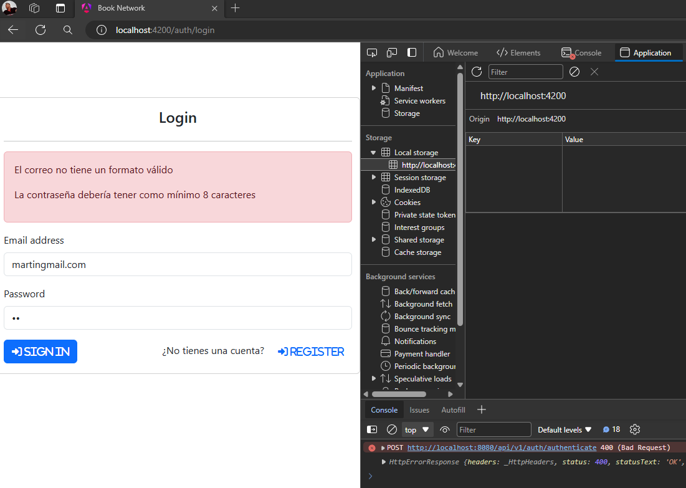
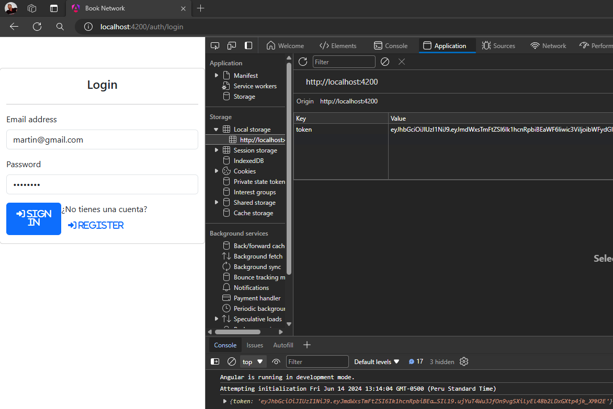
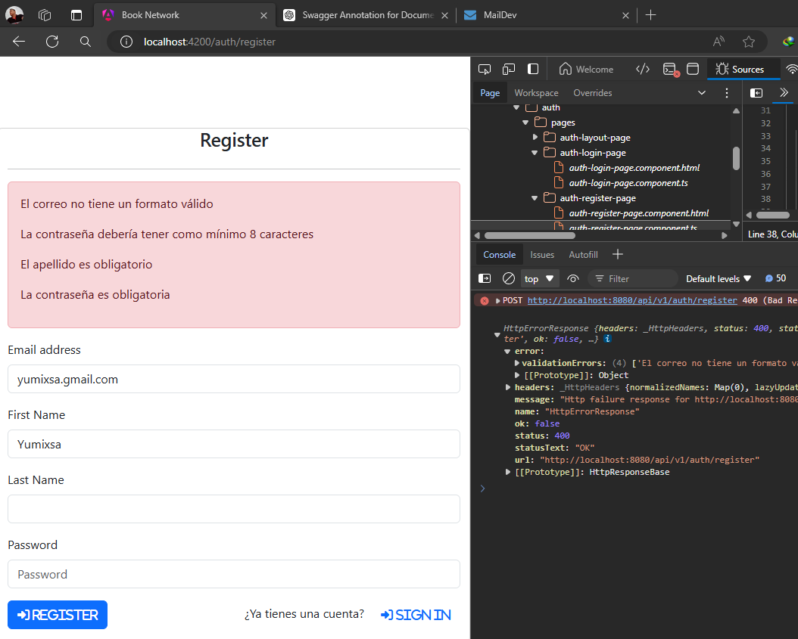
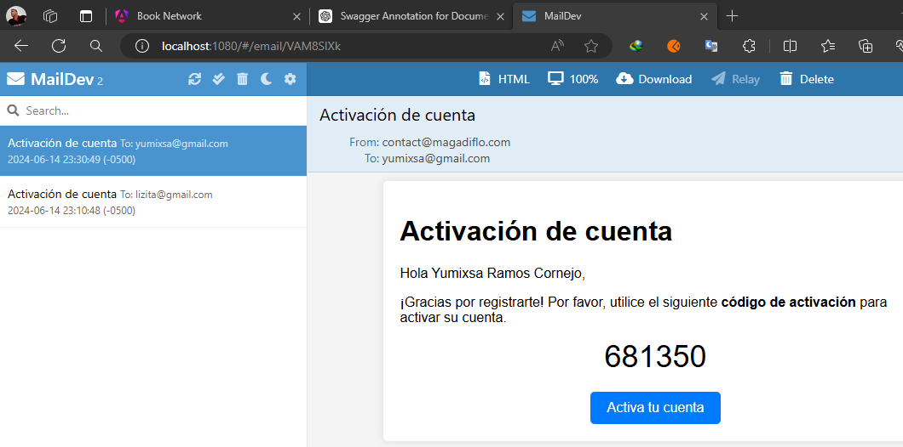
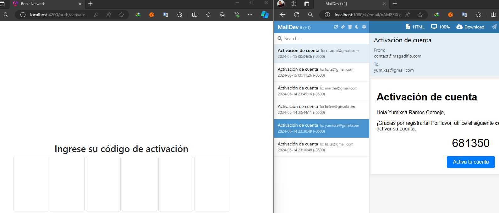
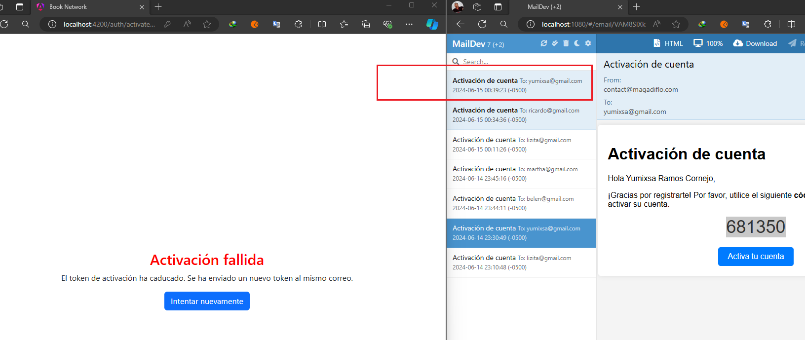
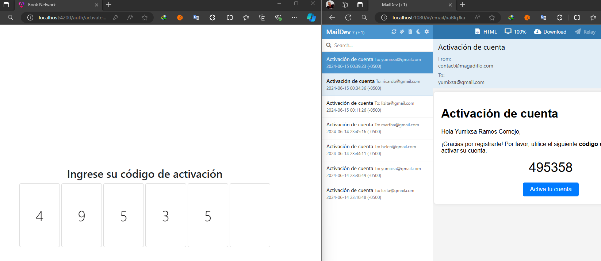
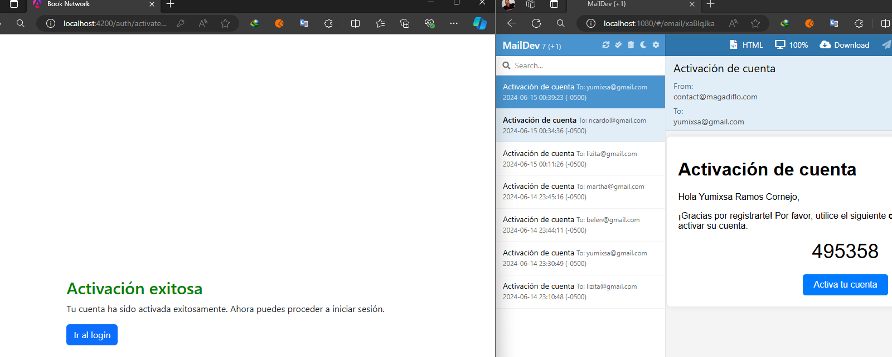
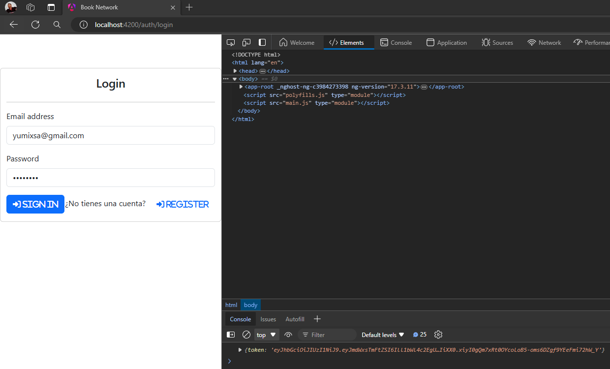

# Frontend (Angular)

This project was generated with [Angular CLI](https://github.com/angular/angular-cli) version 17.3.5.

---

## Agrega dependencia de Bootstrap y fontawesome

Luego crear el proyecto, se agregaron dos dependencias adicionales `bootstrap` y `fontawesome`.

```bash
$ npm i bootstrap@5.3.3
$ npm i @fortawesome/fontawesome-free
```

Luego, en la hoja de estilos globales `styles.scss` hacemos referencia a estas dos dependencias:

```scss
@import 'bootstrap/dist/css/bootstrap.min.css';
@import '@fortawesome/fontawesome-free/css/all.min.css';
```

Antes de finalizar, necesitamos agregar el script de bootstrap `bootstrap.bundle.min.js` en el proyecto. Este script, es importante porque permite que elementos como el `Navbar` funcionen en modo responsivo, así como otros elementos. Para eso, en el archivo `angular.json` agregaremos la referencia al script que viene con la instalación que hicimos de Bootstrap.

```json
"architect": {
  "build": {
    "builder": "@angular-devkit/build-angular:application",
    "options": {
      "outputPath": "dist/book-network-frontend",
      "index": "src/index.html",
      ...
      "assets": [
        "src/favicon.ico",
        "src/assets"
      ],
      "styles": [
        "src/styles.scss"
      ],
      "scripts": [
        "node_modules/bootstrap/dist/js/bootstrap.bundle.min.js"
      ]
    },
  }
}
```

Listo, ahora sí podemos usar `bootstrap` y `fontawesome` en nuestra aplicación de Angular.

## Genera los servicios HTTP usando el poder de OpenApi

**NOTA**

> Lo que veremos a continuación es algo que podría haberlo creado a mano, pero para acelerar el proceso de creación de la aplicación 
> utilizaremos una dependencia que usará el archivo json que genera swagger openApi del backend para construir en automático
> el servicio. Este servicio contendrá pues los métodos que permitan hacer las peticiones al backend.

Necesitamos agregar en nuestra aplicación de Angular la dependencia [ng-openapi-gen](https://www.npmjs.com/package/ng-openapi-gen) que **es un generador de código OpenAPI 3 para Angular.**

```bash
$ npm i ng-openapi-gen
```

Con esta dependencia, lo que haremos será generar en nuestra aplicación de Angular la clase de servicio que se ocupa de realizar las solicitudes http a nuestro backend. En otras palabras,
en vez de que nosotros seamos los que programemos el servicio, lo haremos en automático utilizando la dependencia `ng-openapi-gen`. Esto es posible, gracias a que en el backend estamos usando `swagger y openAPI`,
en ese sentido, aprovechamos en que `openAPI` de nuestro backend nos ofrece la especificación en un formato `.json`, mismo archivo que usaremos en esta aplicación de Angular.

Una vez instalada la dependencia de `ng-openapi-gen`, vamos a configurar el `package.json` para agregar el siguiente script en el apartado de `scripts`
que nos permitirá generar la clase de servicio en función de un archivo `.json`, aunque también es posible que pueda ser en función de un
archivo `.yml`, pero la especificación que nos retorna `openApi` del backend es en un archivo `.json`:


````json
"scripts": {
    "ng": "ng",
    "start": "ng serve",
    "build": "ng build",
    "watch": "ng build --watch --configuration development",
    "test": "ng test",
    "api-gen": "ng-openapi-gen --input ./src/openapi/openapi.json --output ./src/app/services"
}
````

Observemos que hemos agregado un script llamado `"api-gen"` al bloque de `"scripts"`. Este comando está haciendo referencia al archivo `openapi.json` que vamos a crear en un instante, y la salida de dicho archivo lo va a realizar en el directorio `./src/app/services` de nuestra aplicación de Angular.

Antes de ejecutar el script, vamos a crear un directorio llamado `/openapi` dentro del directorio `/src` de Angular. Dentro del directorio
`/openapi` agregaremos un archivo json llamado `openapi.json`.

En este archivo `openapi.json` colocaremos lo que `swagger y openAPI` del backend nos muestran:

```json
{
  "openapi": "3.0.1",
  "info": {
    "title": "OpenAPI Specification - Magadiflo",
    "description": "Documentación OpenAPI para Spring Security",
    "termsOfService": "Términos de servicio",
    "contact": {
      "name": "Magadiflo",
      "url": "https://magadiflo.com/courses",
      "email": "contact@magadiflo.com"
    },
    "license": {
      "name": "Nombre de la licencia",
      "url": "https://some-url.com"
    },
    "version": "1.0"
  },
  "servers": [
    {
      "url": "http://localhost:8080",
      "description": "Local ENV"
    },
    {
      "url": "https://magadiflo.com",
      "description": "Prod ENV"
    }
  ],
  "security": [
    {
      "bearerAuth": []
    }
  ],
  "tags": [
    {
      "name": "Feedback",
      "description": "API Rest de la entidad Feedback"
    },
    {
      "name": "Book",
      "description": "API de Book"
    },
    {
      "name": "Authentication",
      "description": "API de autenticación de usuario"
    }
  ],
  "paths": {
    "/api/v1/feedbacks": {
      "post": {
        "tags": [
          "Feedback"
        ],
        "operationId": "saveFeedback",
        "requestBody": {
          "content": {
            "application/json": {
              "schema": {
                "$ref": "#/components/schemas/FeedbackRequest"
              }
            }
          },
          "required": true
        },
        "responses": {
          "201": {
            "description": "Created",
            "content": {
              "application/json": {
                "schema": {
                  "type": "integer",
                  "format": "int64"
                }
              }
            }
          }
        }
      }
    },
    ...
    },
    ...
}
```

Listo, ahora sí ejecutamos el script:

```bash
M:\PROGRAMACION\DESARROLLO_JAVA_SPRING\02.youtube\18.bouali_ali\08.full_web_application\book-social-network-01\book-network-frontend (main -> origin)
$ npm run api-gen

> book-network-frontend@0.0.0 api-gen
> ng-openapi-gen --input ./src/openapi/openapi.json --output ./src/app/services

Wrote src\app\services\api-configuration.ts
Wrote src\app\services\api.module.ts
Wrote src\app\services\base-service.ts
Wrote src\app\services\fn\authentication\authenticate.ts
Wrote src\app\services\fn\authentication\confirm.ts
Wrote src\app\services\fn\authentication\register.ts
Wrote src\app\services\fn\book\approved-return-borrow-book.ts
Wrote src\app\services\fn\book\borrow-book.ts
Wrote src\app\services\fn\book\find-all-books-by-owner.ts
Wrote src\app\services\fn\book\find-all-books.ts
Wrote src\app\services\fn\book\find-all-borrowed-books.ts
Wrote src\app\services\fn\book\find-all-returned-books.ts
Wrote src\app\services\fn\book\find-book-by-id.ts
Wrote src\app\services\fn\book\return-borrow-book.ts
Wrote src\app\services\fn\book\save-book.ts
Wrote src\app\services\fn\book\update-archived-status.ts
Wrote src\app\services\fn\book\update-shareable-status.ts
Wrote src\app\services\fn\book\upload-book-cover-picture.ts
Wrote src\app\services\fn\feedback\find-all-feedback-by-book.ts
Wrote src\app\services\fn\feedback\save-feedback.ts
Wrote src\app\services\models\authentication-request.ts
Wrote src\app\services\models\authentication-response.ts
Wrote src\app\services\models\book-request.ts
Wrote src\app\services\models\book-response.ts
Wrote src\app\services\models\borrowed-book-response.ts
Wrote src\app\services\models\feedback-request.ts
Wrote src\app\services\models\feedback-response.ts
Wrote src\app\services\models\page-response-book-response.ts
Wrote src\app\services\models\page-response-borrowed-book-response.ts
Wrote src\app\services\models\page-response-feedback-response.ts
Wrote src\app\services\models\registration-request.ts
Wrote src\app\services\models.ts
Wrote src\app\services\request-builder.ts
Wrote src\app\services\services\authentication.service.ts
Wrote src\app\services\services\book.service.ts
Wrote src\app\services\services\feedback.service.ts
Wrote src\app\services\services.ts
Wrote src\app\services\strict-http-response.ts
Generation from ./src/openapi/openapi.json finished with 11 models and 3 services.
```
Como resultado de la ejecución del script, vemos que se crea el directorio `/services` dentro de `/app` y dentro de él toda la funcionalidad ya implementada del servicio, es decir, los métodos que hacen llamada a los endpoints del backend ya están implementadas.

**Importante**

> Recordemos que estamos dejando en manos de la librería `ng-openapi-gen` la generación de todo el servicio en función de la 
> especificación que obtuvimos de la documentación de `Swagger`.
>
> Ahora, si revisamos los endpoints `/register` y `/activate-account` del backend, veremos que dichos endpoints
> retornan `void`. No he investigado mucho, pero he deducido que retornar ese `void` hace que cuando
> usemos la librería `ng-openapi-gen`, cree la petición esperando que se obtenga un texto, de esta manera:
> `rb.build({ responseType: 'text', accept: '*/*', context })`, esto hace que cuando generemos un error en el endpoint, ya sea
> un error de validación (por ejemplo), la respuesta se obtenga en texto y no en objeto json. 
>
> Entonces, para solucionarlo, es que manualmente tenemos que ir a los archivos que esperan ese texto como respuesta 
> (`confirm.ts` y `register.ts`) y cambiar la respuesta que se generó en texto `rb.build({ responseType: 'text', accept: '*/*', context })` 
> por una respuesta esperada en json, tal como se ve a continuación `rb.build({ responseType: 'json', accept: 'application/json', context })`.
>
> Algo a tener en cuenta, es que si en el backend, en vez de retornar un `ResponseEntity<Void>` (`Void` que es el que nos está generando esta situación),
> retornáramos un `ResponseEntity<?>`, entonces tendríamos más flexibilidad, ya que usando el `?` estaríamos indicando que podemos devolver cualquier 
> tipo de dato, eso haría que al generar la especificación con `OpenAPI` nos genere la petición como un `json` y no como un `text`.
>
> Tengamos en cuenta, que esto ocurre proque estamos usamos una herramienta que nos ayuda a generar el servicio completo a partir
> de la especificación generada por `OpenAPI/Swagger`, pero si nosotros mismos construimos el servicio, no tendríamos que realizar ninguna 
> modificación, ni nada por el estilo, es decir trabajaríamos con el `ResponseEntity<Void>` sin ningún problema.

Finalmente, como estamos trabajando con `Angular 17` necesitaremos utilizar el `HttpClient` para realizar las peticiones al backend, para eso agregaremos la función `provideHttpClient()` en el `app.config.ts`:

```typescript
export const appConfig: ApplicationConfig = {
  providers: [
    provideRouter(APP_ROUTES),
    provideHttpClient(),
  ]
};
```

## Implementa el Login Page

Vamos a crear un directorio llamado `/auth` que albergará nuestros componentes de login, register y activate account, además definiremos nuestras rutas para dicho paquete. Empecemos creando el componente `AuthLayoutPageComponent`, este componente servirá como contenedor de los otros componentes.

```typescript
@Component({
  selector: 'auth-layout-page',
  standalone: true,
  imports: [RouterOutlet],
  templateUrl: './auth-layout-page.component.html',
  styles: ``
})
export class AuthLayoutPageComponent {

}
```

```html
<router-outlet />
```

Ahora sí, creamos nuestro componente `AuthLoginPage` e implementamos la funcionalidad de inicio de sesión:

```typescript

@Component({
  selector: 'auth-login-page',
  standalone: true,
  imports: [ReactiveFormsModule],
  templateUrl: './auth-login-page.component.html',
  styleUrl: './auth-login-page.component.scss'
})
export class AuthLoginPageComponent {

  private _formBuilder = inject(NonNullableFormBuilder);
  private _router = inject(Router);
  private _authenticationService = inject(AuthenticationService);
  private _tokenService = inject(TokenService);

  public errorMessages: string[] = [];
  public form: FormGroup = this._formBuilder.group({
    email: this._formBuilder.control<string>('martin@gmail.com'),
    password: this._formBuilder.control<string>('12345678'),
  });

  public login(): void {
    this.errorMessages = [];
    this._authenticationService.authenticate({ body: this.form.value })
      .subscribe({
        next: response => {
          console.log(response);
          this._tokenService.token = response.token as string;
          this._router.navigate(['/books']);
        },
        error: err => {
          console.log(err);
          if (err.error.validationErrors) {
            this.errorMessages = err.error.validationErrors;
          } else {
            console.log(err.error);
            this.errorMessages.push(err.error.businessErrorDescription);
          }
        }
      });
  }

  public register(): void {
    this._router.navigate(['/auth', 'register']);
  }

}
```

**¡IMPORTANTE!**, notar que en el componente anterior estamos haciendo uso de la clase de servicios que creamos automáticamente con la ayuda de `ng-openapi-gen`.

```html
<div class="container-fluid card auth-container">
  <h3 class="text-center mt-3">Login</h3>
  <hr>
  @if (errorMessages.length) {
  <div class="alert alert-danger" role="alert">
    @for (msg of errorMessages; track $index) {
    <p>{{ msg }}</p>
    }
  </div>
  }
  <form [formGroup]="form">
    <div class="mb-3">
      <label for="email" class="form-label">Email address</label>
      <input type="email" class="form-control" formControlName="email" id="email" placeholder="name@example.com">
    </div>
    <div class="mb-3">
      <label for="password" class="form-label">Password</label>
      <input type="password" class="form-control" formControlName="password" id="password" placeholder="Password">
    </div>
    <div class="d-flex justify-content-between mb-3">
      <button type="button" (click)="login()" class="btn btn-primary">
        <em class="fas fa-sign-in-alt">&nbsp;Sign in</em>
      </button>
      <div>
        ¿No tienes una cuenta?&nbsp;
        <button type="button" (click)="register()" class="btn btn-link">
          <i class="fas fa-sign-in-alt">&nbsp;Register</i>
        </button>
      </div>
    </div>
  </form>
</div>
```

En el archivo de estilos globales `styles.scss` agregamos el siguiente estilo:

```scss
.auth-container {
  max-width: 800px;
  margin-top: 15%;
}
```

Si observamos nuestro componente de Login, podemos ver que está haciendo uso de un servicio llamado `TokenService`. Este servicio nos permitirá almacenar y recuperar el token del `localStorage`. Entonces, crearemos dicho servicio dentro de nuestro paquete de auth: `/auth/services/token.service.ts`.

```typescript
@Injectable({
  providedIn: 'root'
})
export class TokenService {

  public set token(token: string) {
    localStorage.setItem('token', token);
  }

  public get token(): string {
    return localStorage.getItem('token') as string;
  }

}
```

Finalmente, necesitamos crear las rutas con las que va a trabajar nuestros componentes. Para eso crearemos una ruta dentro del paquete `/auth` y configuraremos las rutas del login, register y activate account. Además, agregaremos rutas en el archivo rutas principales `app.routes.ts`:


```typescript
//book-network-frontend\src\app\auth\auth.routes.ts
export default [
  {
    path: '',
    component: AuthLayoutPageComponent,
    children: [
      { path: 'login', component: AuthLoginPageComponent, },
      { path: '**', redirectTo: 'login', },
    ],
  }

] as Routes;
```

```typescript
//book-network-frontend\src\app\app.routes.ts
export const APP_ROUTES: Routes = [
  {
    path: 'auth',
    loadChildren: () => import('./auth/auth.routes'),
  },
  { path: '**', redirectTo: '/auth', },
];
```

## Prueba el Login Page

Validando solicitud desde el backend:



Login exitoso, registro de token en el localStorage:



> Notar que aunque el login fue exitoso, estamos en la misma página dado que aún no hay otras páginas que hayamos implementado.

## Implementa Register Page

En esta sección crearemos la página para el registro de usuarios.

```typescript
@Component({
  selector: 'app-auth-register-page',
  standalone: true,
  imports: [ReactiveFormsModule],
  templateUrl: './auth-register-page.component.html',
  styleUrl: './auth-register-page.component.scss'
})
export default class AuthRegisterPageComponent {

  private _formBuilder = inject(NonNullableFormBuilder);
  private _router = inject(Router);
  private _authenticationService = inject(AuthenticationService);

  public errorMessages: string[] = [];
  public form: FormGroup = this._formBuilder.group({
    email: [''],
    firstName: [''],
    lastName: [''],
    password: [''],
  });

  public login(): void {
    this._router.navigate(['/auth', 'login']);
  }

  public register(): void {
    this.errorMessages = [];
    this._authenticationService.register({ body: this.form.value })
      .subscribe({
        next: () => this._router.navigate(['/auth', 'activate-account']),
        error: err => {
          console.log(err);
          this.errorMessages = err.error.validationErrors;
        },
      });
  }

}
```

Notar que la ruta `/activate-account` aún no lo hemos implementado, eso lo haremos en la siguiente sección.

```html
<div class="container-fluid card auth-container">
  <h3 class="text-center">Register</h3>
  <hr>
  @if (errorMessages.length) {
  <div class="alert alert-danger" role="alert">
    @for (msg of errorMessages; track $index) {
    <p>{{ msg }}</p>
    }
  </div>
  }
  <form [formGroup]="form">
    <div class="mb-3">
      <label for="email" class="form-label">Email address</label>
      <input type="email" class="form-control" formControlName="email" id="email" placeholder="name@example.com">
    </div>
    <div class="mb-3">
      <label for="firstName" class="form-label">First Name</label>
      <input type="text" class="form-control" formControlName="firstName" id="firstName">
    </div>
    <div class="mb-3">
      <label for="lastName" class="form-label">Last Name</label>
      <input type="text" class="form-control" formControlName="lastName" id="lastName">
    </div>
    <div class="mb-3">
      <label for="password" class="form-label">Password</label>
      <input type="password" class="form-control" formControlName="password" id="password" placeholder="Password">
    </div>
    <div class="d-flex justify-content-between mb-3">
      <button type="button" (click)="register()" class="btn btn-primary">
        <i class="fas fa-sign-in-alt">&nbsp;Register</i>
      </button>
      <div>
        ¿Ya tienes una cuenta?&nbsp;
        <button type="button" (click)="login()" class="btn btn-link">
          <em class="fas fa-sign-in-alt">&nbsp;Sign in</em>
        </button>
      </div>
    </div>
  </form>
</div>
```

Finalmente, agregamos la ruta para este nuevo componente:

```typescript
export default [
  {
    path: '',
    component: AuthLayoutPageComponent,
    children: [
      { path: 'login', component: AuthLoginPageComponent, },
      {
        path: 'register',
        loadComponent: () => import('./pages/auth-register-page/auth-register-page.component'),
      },
      { path: '**', redirectTo: 'login', },
    ],
  }
] as Routes;
```

## Prueba el Register Page

Vamos a registrar un usuario y ver la validación que nos realiza el backend:



Ahora realizamos un registro con todos los campos correctos. Cuando realizamos el registro, en automático nos redirecciona a la página para activar la cuenta, pero como todavía no lo tenemos implementado nos mostrará el login por defecto. Lo que sí debemos observar es que cuando nos registramos el código de activación llega al correo del usuario.



## Implementa el Activate Account Page

Una vez que un usuario se registra es redireccionado a la página de activación de de su cuenta para que ingrese el código de activación que se le envía a su correo. Para acelerar la implementación de esta página, vamos a agregar una dependencia para que nos cree una entrada (input) donde agregaremos el código de activación, aunque lo podríamos hacer de manera manual.

Entonces, necesitamos instalar [Angular Code Input](https://www.npmjs.com/package/angular-code-input).

```bash
$ npm i angular-code-input
```

Una vez instalada la dependencia procedemos a constuir el componente `AuthActivateAccountPage`.

```typescript
@Component({
  selector: 'auth-activate-account-page',
  standalone: true,
  imports: [CodeInputModule],
  templateUrl: './auth-activate-account-page.component.html',
  styleUrl: './auth-activate-account-page.component.scss'
})
export default class AuthActivateAccountPageComponent {

  private _router = inject(Router);
  private _authenticationService = inject(AuthenticationService);

  public message = '';
  public isOk = true;
  public submitted = false;

  public onCodeCompleted(activationCode: string) {
    console.log({ activationCode });
    this._authenticationService.confirm({ token: activationCode })
      .subscribe({
        next: () => {
          this.message = 'Tu cuenta ha sido activada exitosamente.\nAhora puedes proceder a iniciar sesión.';
          this.submitted = true;
          this.isOk = true;
        },
        error: err => {
          console.log(err);
          this.message = err.error.error;
          this.submitted = true;
          this.isOk = false;
        }
      });

  }

  public redirectToLogin() {
    this._router.navigate(['/auth', 'login']);
  }

}
```

**NOTA**, fijémonos que estmos usando la palabra reservada `default` en la definición de la clase, esto lo hacemos porque en el archivo de rutas `auth.routes.ts` utilizamos la siguiente instrucción para cargar este componente:
> `loadComponent: () => import('./pages/auth-activate-account-page/auth-activate-account-page.component')` 

Si no usáramos la palabra `default` en la definición de la clase, entonces tendríamos que importar el componente de esta otra manera:
> `loadComponent: () => import('./pages/auth-activate-account-page/auth-activate-account-page.component').then(c => c.AuthActivateAccountPageComponent)`

```html
@if (submitted) {
<div class="container">
  @if (isOk) {
  <div class="activate-message">
    <h2 class="successful">Activación exitosa</h2>
    <p>{{ message }}</p>
    <button type="button" class="btn btn-primary" (click)="redirectToLogin()">Ir al login</button>
  </div>
  }@else {
  <div class="activate-errro text-center">
    <h2 class="failed text-center">Activación fallida</h2>
    <p class="text-center">{{ message }}</p>
    <button type="button" class="btn btn-primary" (click)="submitted = false">Intentar nuevamente</button>
  </div>
  }
</div>
} @else {
<div class="container">
  <div class="text-center" style="width: 800px;">
    <h2>Ingrese su código de activación</h2>
    <code-input [isCodeHidden]="false" [codeLength]="6" [code]="'number'" (codeCompleted)="onCodeCompleted($event)"
      [className]="'large-text'"></code-input>
  </div>
</div>
}
```

```scss
.container {
  display: flex;
  justify-content: center;
  align-items: center;
  height: 100vh;
}

.successful {
  color: green;
}

.failed {
  color: red;
}

.large-text {
  font-size: 40px;
}
```

Finalmente, agregamos la ruta correspondiente a este componente en el archivo `auth.routes.ts`:

```typescript
export default [
  {
    path: '',
    component: AuthLayoutPageComponent,
    children: [
      { path: 'login', component: AuthLoginPageComponent, },
      {
        path: 'register',
        loadComponent: () => import('./pages/auth-register-page/auth-register-page.component'),
      },
      {
        path: 'activate-account',
        loadComponent: () => import('./pages/auth-activate-account-page/auth-activate-account-page.component'),
      },
      { path: '**', redirectTo: 'login', },
    ],
  }
] as Routes;
```

## Prueba el Activate Account Page

En la siguiente imagen observamos un código de activación que ha recibido el usuario en su correo. Ese código deberá ser agregada en los input de la página de angular.



La siguiente imagen muestra lo que se produce cuando ingresamos un código de activación que ha expirado. En la parte derecha observamos que nos llega un mensaje con un nuevo código de activación.



Ahora utilizamos el nuevo código de activación que se nos envía al correo:



Como observamos el código fue aceptado, por lo tanto el usuario ahora está habilitado para poder iniciar sesión.



Ahora intentemos iniciar sesión con el usuario activado. Observamos que efectivamente, estamos recibiendo un token de acceso, eso significa que el usuario está dado de alta correctamente.



## Crea el paquete de books

Vamos a agrupar toda la funcionalidad de `books` dentro de un paquete con el mismo nombre. Empezaremos creando la ruta hija para books luego modificaremos la ruta principal:

```typescript
//book-network-frontend\src\app\books\books.routes.ts
export default [
  {
    path: '',
    component: BookLayoutPageComponent,
  }
] as Routes;
```

```typescript
//book-network-frontend\src\app\app.routes.ts
export const APP_ROUTES: Routes = [
  // another path
  {
    path: 'books',
    loadChildren: () => import('./books/books.routes'),
  },
  // another path
];
```

Si observamos, la ruta hija, tiene un componente llamado `BookLayoutPageComponent` que hemos creado para poder contener todos los componentes que se creen para esta funcionalidad de books.

```typescript
//book-network-frontend\src\app\books\pages\book-layout-page\book-layout-page.component.ts
@Component({
  selector: 'app-book-layout-page',
  standalone: true,
  imports: [RouterOutlet],
  templateUrl: './book-layout-page.component.html',
  styles: ``
})
export class BookLayoutPageComponent {

}
```

```html
<div>
  Menú de la aplicación de book
</div>
<main>
  <router-outlet />
</main>
```

## Implementa el MenuComponent

Crearemos un componente que contendrá el menú de nuestra aplicación.

```typescript
//book-network-frontend\src\app\books\components\menu\menu.component.ts
@Component({
  selector: 'books-menu',
  standalone: true,
  imports: [RouterLink, RouterLinkActive],
  templateUrl: './menu.component.html',
  styleUrl: './menu.component.scss'
})
export class MenuComponent {

  public logout() {
    console.log('logout()...');
  }

}
```
```html
<!--book-network-frontend\src\app\books\components\menu\menu.component.html-->
<nav class="navbar navbar-expand-lg bg-body-tertiary bg-dark" data-bs-theme="dark">
  <div class="container-fluid">
    <a class="navbar-brand" href="javascript:void(0);">BSN</a>
    <button class="navbar-toggler" type="button" data-bs-toggle="collapse" data-bs-target="#navbarSupportedContent"
      aria-controls="navbarSupportedContent" aria-expanded="false" aria-label="Toggle navigation">
      <span class="navbar-toggler-icon"></span>
    </button>
    <div class="collapse navbar-collapse" id="navbarSupportedContent">
      <ul class="navbar-nav me-auto mb-2 mb-lg-0">
        <li class="nav-item">
          <a class="nav-link" [routerLink]="['/books']" routerLinkActive="active"
            [routerLinkActiveOptions]="{exact: true}">
            <i class="fas fa-home-alt"></i>&nbsp;Inicio
          </a>
        </li>
        <li class="nav-item">
          <a class="nav-link" [routerLink]="['/books', 'my-books']" routerLinkActive="active"
            [routerLinkActiveOptions]="{exact: true}">
            <i class="fas fa-book"></i>&nbsp;Mis libros
          </a>
        </li>
        <li class="nav-item">
          <a class="nav-link" [routerLink]="['/books', 'my-waiting-list']" routerLinkActive="active"
            [routerLinkActiveOptions]="{exact: true}">
            <i class="fas fa-clipboard-list"></i>&nbsp;Mi lista de espera
          </a>
        </li>
        <li class="nav-item">
          <a class="nav-link" [routerLink]="['/books', 'my-returned-books']" routerLinkActive="active"
            [routerLinkActiveOptions]="{exact: true}">
            <i class="fas fa-retweet"></i>&nbsp;Mis libros devueltos
          </a>
        </li>
        <li class="nav-item">
          <a class="nav-link" [routerLink]="['/books', 'my-borrowed-books']" routerLinkActive="active"
            [routerLinkActiveOptions]="{exact: true}">
            <i class="fas fa-book-open"></i>&nbsp;Mis libros prestados
          </a>
        </li>
      </ul>
      <form class="d-flex gap-2 align-items-center" role="search">
        <input class="form-control me-2" type="search" placeholder="Search" aria-label="Search">
        <button class="btn btn-outline-success" type="submit" aria-label="Start search">
          <i class="fas fa-search"></i>
        </button>
        <span class="text-secondary">Welcome</span>
        <span class="text-capitalize fw-bold text-white">Martín</span>
        <button class="btn btn-link text-danger" type="button" (click)="logout()" aria-label="logout">
          <i class="fas fa-door-open"></i>
        </button>
      </form>
    </div>
  </div>
</nav>
```

Importante observar que estamos haciendo uso de algunas características que nos brinda Angular,  como el uso del `routerLinkActive="active"` quien nos permite agregar la clase `active` cuando estamos en la ruta especificada. Además, estamos haciendo uso del `[routerLinkActiveOptions]="{exact: true}"`, esto nos dice que la ruta debe ser exactamente igual con la ruta que hemos especificado en el router link. Si no usamos esta útlima característica, como todos los menú tienen el `routerLinkActive="active"`, cada vez que vayamos a un link, al menú se le agregará la clase `active` (hasta ahí todo correcto), pero cuando vayamos a otro menú, el menú anterior seguirá con la clase active.


```scss
li>a {
  &:hover {
    background-color: #d6e5f1;
    border-radius: 5px;
    color: #2B3035;
  }
}
```

Finalmente, el componente de menú lo agregamos al layout de books:

```typescript
@Component({
  selector: 'app-book-layout-page',
  standalone: true,
  imports: [RouterOutlet, MenuComponent],
  templateUrl: './book-layout-page.component.html',
  styles: ``
})
export class BookLayoutPageComponent {

}
```

```html
<books-menu />
<main>
  <router-outlet />
</main>
```

## Implementa la página de lista de libros

Creamos el componente para listrar los libros

```typescript

@Component({
  selector: 'app-book-list',
  standalone: true,
  imports: [],
  templateUrl: './book-list.component.html',
  styleUrl: './book-list.component.scss'
})
export class BookListComponent implements OnInit {

  private _router = inject(Router);
  private _bookService = inject(BookService);

  public bookResponse?: PageResponseBookResponse;
  public page = 0;
  public size = 5;

  ngOnInit(): void {
    this.findAllBooks();
  }

  public findAllBooks() {
    this._bookService.findAllBooks({ page: this.page, size: this.size })
      .subscribe({
        next: pageBookResponse => {
          this.bookResponse = pageBookResponse;
        }
      });
  }

}
```

```html
<div class="container mt-4">
  <h3>Lista de libros</h3>
  <hr>
  <div class="d-flex justify-content-start gap-2 flex-wrap">
    @if (bookResponse) {

    } @else {
      <div class="alert alert-info">Recuperando lista de libros...</div>
    }
  </div>
</div>
```

Finalmente, en la ruta de libros, agregamos la ruta a este nuevo componente

```typescript
export default [
  {
    path: '',
    component: BookLayoutPageComponent,
    children: [
      {
        path: '',
        component: BookListComponent,
      },
      { path: '**', redirectTo: '', },
    ],
  }
] as Routes;
```
